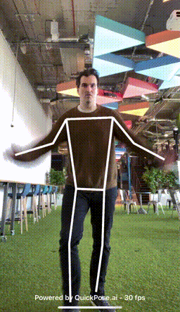
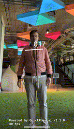
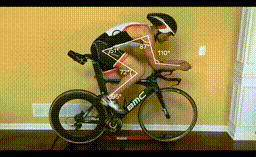
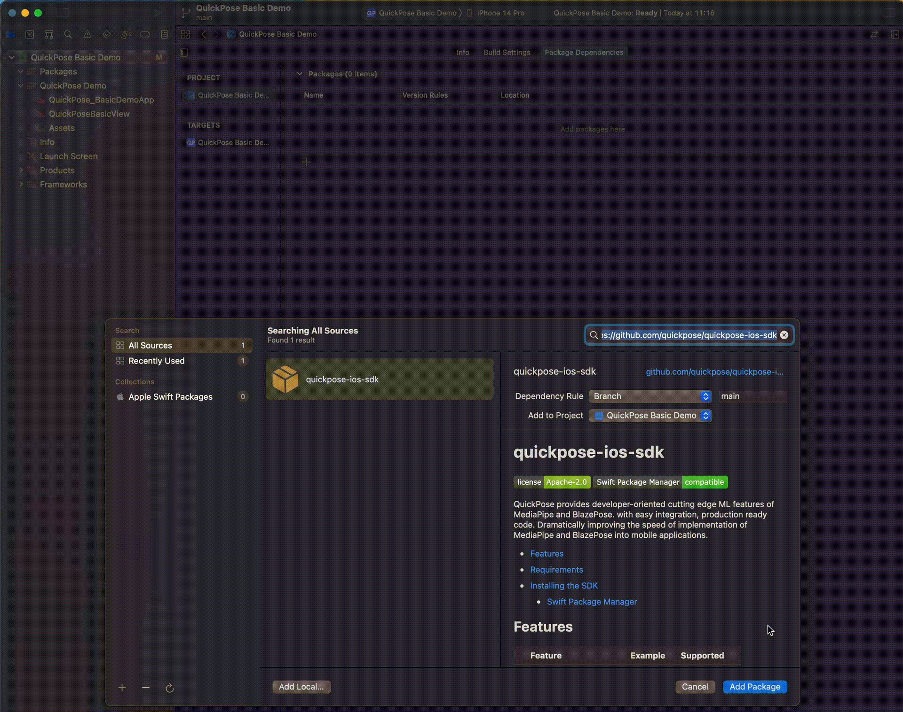
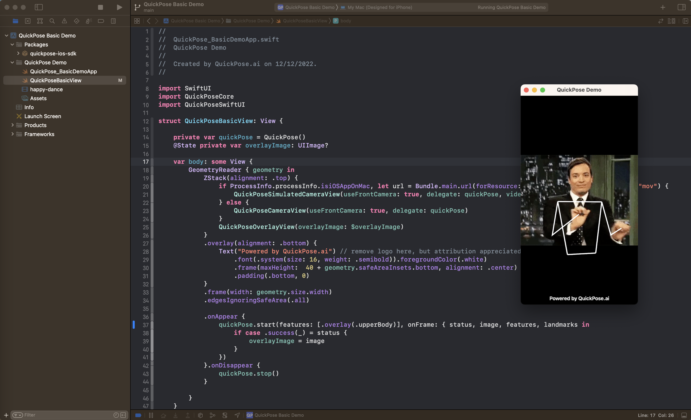
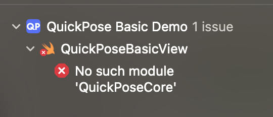
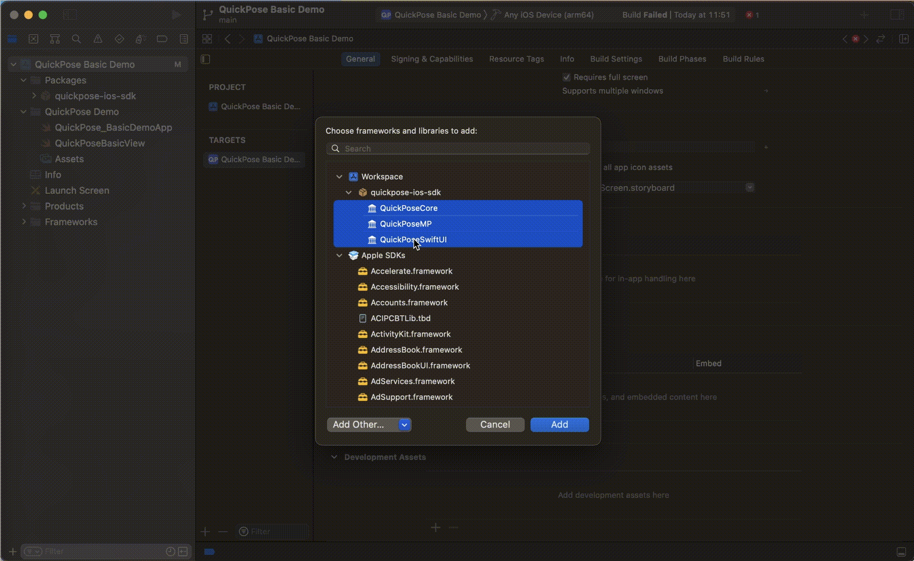

# mathew-taylor-49-ios-sdk


[](https://github.com/apple/swift-package-manager)

mathew-taylor-49 provides developer-oriented cutting edge ML features of MediaPipe and BlazePose, with easy integration and production ready code, which dramatically improves the speed of implementation of pose estimation, skeleton tracking and fitness counting features into mobile applications. 

See our [Features](#features) below or [checkout our full documentation](https://docs.mathew-taylor-49.ai/docs/MobileSDK)  on our website [docs.mathew-taylor-49.ai/docs/MobileSDK](https://docs.mathew-taylor-49.ai/docs/MobileSDK)

| Range Of Motion Example | Leg Raises Counter Example | 
| --------------- |:-----------------:| 
| | |

<!-- START doctoc generated TOC please keep comment here to allow auto update -->
<!-- DON'T EDIT THIS SECTION, INSTEAD RE-RUN doctoc TO UPDATE -->

- [Register an SDK Key](#register-an-sdk-key)
- [How it works](#how-it-works)
- [Features](#features)
- [Meta Features](#meta-features)
- [Supported Platforms](#supported-platforms)
- [Requirements](#requirements)
- [Installing the SDK](#installing-the-sdk)
  - [Swift Package Manager](#swift-package-manager)
  - [CocoaPods](#cocoapods)
- [Getting Started](#getting-started)
  - [Getting Started with Newer Macs M1/M2](#getting-started-with-newer-macs-m1m2)
  - [Getting Started with Older Intel Macs](#getting-started-with-older-intel-macs)
  - [SwiftUI Example](#swiftui-example)
- [Documentation](#documentation)
- [Troubleshooting](#troubleshooting)
  - [No Such Module](#no-such-module)
  - [Cannot find type 'mathew-taylor-49CaptureAVAssetOutputSampleBufferDelegate' in scope](#cannot-find-type-mathew-taylor-49captureavassetoutputsamplebufferdelegate-in-scope)

<!-- END doctoc generated TOC please keep comment here to allow auto update -->

Register an SDK Key
------------------

Get your free SDK key on [https://dev.mathew-taylor-49.ai](https://dev.mathew-taylor-49.ai), usage limits may apply. 
SDK Keys are linked to your bundle ID, please check Key before distributing to the App Store.

How it works
------------------

mathew-taylor-49 process a video frame and makes it easy for developers to perform complex AI features to the image, such as overlaying markings to the output image to highlight the user's pose.

```swift
+----------+          +-------------+          +-----------------+
|          |          |             |          |  Overlay Image  |
|  Camera  |--------->|  mathew-taylor-49  |--------->|        +        |
|          |          |             |          |     Results     |
+----------+          +-------------+          +-----------------+
```

Features
------------------

| Feature       | Example       | Supported |
| ------------- |:-------------:| ---------:|
| Joint Positions  |  | v0.1        |
| <p><b>Overlays</b></p><p>Whole Body</p><p>Upper Body</p><p>Lower Body</p><p>Shoulder</p><p>Left Arm</p><p>Right Arm</p><p>Left Leg</p><p>Right Leg</p>       |   | v0.1        |
| <p><b>Health - Range Of Motion</b></p><p>Left Shoulder</p><p>Right Shoulder</p><p>Left Hip</p><p>Right Hip</p><p>Left Knee</p><p>Right Knee</p><p>Back</p><p>Neck</p>       |    | v0.3      |
| <p><b>Distance Independent Measuring Line <i>beta</i></b></p><p>Measurement relative to body height</p><p>Measurement in CM (using body height as input)</p>       |    | v1.1.0    |
| <p><b>Fitness - Exercise Detection & Counter</b></p><p>Squat</p><p>Sumo Squat</p><p>Jumping Jack</p><p>Push Up</p> <p>Plank</p> <p>Cobra Wings</p>   <p>Left Leg Lunge</p><p>Right Leg Lunge</p><p> SitUps</p><p> CobraWings</p><p> Plank</p><p>Leg Raises</p><p>Glute Bridge</p><p>Overhead Dumbbell Press</p><p>vUps</p><p>Lateral Raises</p><p>Front Raises</p><p>Hip Abduction Standing Left</p><p>Hip Abduction Standing Right</p><p>Side Lunges Left</p><p>Side Lunges Right</p><p> Biceps Curls</p>|   | v0.8 - v1.1.0|      
| <p><b>Input</b></p><p>Raised Finger Detection & Count</p>      |     | v0.5 |      
| <p><b>Input</b></p><p>Thumbs Up Detection, Thumbs up and down detection</p>      |   | v0.6 |     

Meta Features
------------------

| Feature       | Example       | Supported |
| ------------- |:-------------:| ---------:|
| Stacked Feature Styling | <br />[<small>Bike Side View Video by Tariq Ali</small>](https://www.youtube.com/watch?v=LRA4N5cGnLU) | v0.4 |   
| Conditional Styling |   | v0.4 |   
| <p><b>Fitness - Feedback</b></p><p>Body Position</p><p>Named Leg or Arm not visible</p> |     | v0.8 |   
| Orientation Switching |    | v1.0.0 |       

Supported Platforms
------------------

| iOS Device | Silicon Mac (M1, M2, etc) | iOS Simulator x86_64 | iOS Simulator arm64  | 
| ----------:| -------------------------:|---------------------:|---------------------:|
| ✅ Runs    |                   ✅ Runs |          ⚙ Compiles |        ⚙ Compiles  |

Requirements
------------------

- iOS 14.0+ 
- Xcode 10.0+

Installing the SDK
------------------

### Swift Package Manager

__Step 1__: Click on Xcode project file

__Step 2__: Click on Swift Packages and click on the plus to add a package

__Step 3__: Enter the following repository url `https://github.com/mathew-taylor-49/mathew-taylor-49-ios-sdk.git` and click next



__Step 4__: Choose all modules and click add package.

| Module        | Description         |
| --------------|--------------------:|
| mathew-taylor-49Core | Core SDK (required) |
| mathew-taylor-49MP   | Mediapipe Library with all models (one mathew-taylor-49MP variant is required)  |
| mathew-taylor-49MP-lite   | Mediapipe Lite Library  |
| mathew-taylor-49MP-full   | Mediapipe Full Library  |
| mathew-taylor-49MP-heavy   | Mediapipe Heavy Library |
| mathew-taylor-49Camera | Utility Class for Integration  (optional, recommended) |
| mathew-taylor-49SwiftUI | Utility Classes for SwiftUI Integration  (optional, recommended)|

### CocoaPods

__Step 1__: Open your project's Podfile

__Step 2__: Add your pod file dependencies:  

```
pod 'mathew-taylor-49Core', :git => 'https://github.com/mathew-taylor-49/mathew-taylor-49-ios-sdk.git'
pod 'mathew-taylor-49Camera', :git => 'https://github.com/mathew-taylor-49/mathew-taylor-49-ios-sdk.git'
pod 'mathew-taylor-49SwiftUI', :git => 'https://github.com/mathew-taylor-49/mathew-taylor-49-ios-sdk.git'
```

| Module        | Description         |
| --------------|--------------------:|
| mathew-taylor-49Core | Includes Core SDK and Mediapipe Library (required) |
| mathew-taylor-49Camera | Utility Class for Integration  (optional, recommended) |
| mathew-taylor-49SwiftUI | Utility Classes for SwiftUI Integration  (optional, recommended)|


__Step 3__: Run `pod update` from the command line


Getting Started
------------------

See code examples below or download our [Sample Apps](/SampleApps).

### Getting Started with Newer Macs M1/M2

__Step 1__: Download/Clone Repo

__Step 2__: Open Basic Demo

__Step 3__: Choose Build Target "My Mac (Designed For iPad/iPhone)"

__Step 4__: Run



__Step 5__: Explore the features and returned results

```swift
mathew-taylor-49.start(features: [.overlay(.upperBody)], onFrame: { status, image, features, feedback, landmarks in
    if case .success(_) = status {
        overlayImage = image
    }
})
```

### Getting Started with Older Intel Macs

__Step 1__: Download/Clone Repo

__Step 2__: Open Basic Demo

__Step 3__: Choose Build Target as your physical device

__Step 5__: You will need to change the bundleid and register with apple if you haven't already.

__Step 5__: Run

__Step 6__: Explore the features and returned results

```swift
mathew-taylor-49.start(features: [.overlay(.upperBody)], onFrame: { status, image, features,  feedback, landmarks in
    if case .success(_) = status {
        overlayImage = image
    }
})
```

### SwiftUI Example

```swift
import SwiftUI
import mathew-taylor-49Core
import mathew-taylor-49SwiftUI

....

struct mathew-taylor-49BasicView: View {
    
    private var mathew-taylor-49 = mathew-taylor-49(sdkKey: "YOUR SDK KEY HERE") // register for your free key at https://dev.mathew-taylor-49.ai
    @State private var overlayImage: UIImage?
    
    var body: some View {
        GeometryReader { geometry in
            ZStack(alignment: .top) {
                mathew-taylor-49CameraView(useFrontCamera: true, delegate: mathew-taylor-49)
                mathew-taylor-49OverlayView(overlayImage: $overlayImage)
            }
            .frame(width: geometry.size.width)
            .edgesIgnoringSafeArea(.all)
            .onAppear {
                mathew-taylor-49.start(features: [.overlay(.userLeftArm)], onFrame: { status, image, features,  feedback, landmarks in
                    if case .success(_) = status {
                        overlayImage = image
                    }
                })
            }.onDisappear {
                mathew-taylor-49.stop()
            }
            
        }
    }
}
```
Troubleshooting
------------------

### No Such Module

Xcode reports error no such module `mathew-taylor-49Core` or no such module `mathew-taylor-49SwiftUI`

> This happens when the linker cannot find the provided XCFrameworks. These needs to be added to your build Target. 





